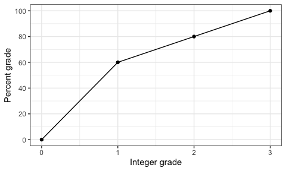

Assignment Schedule
================

Here is the schedule of assignments, with links to appear after
assignments are released. Your completed assignments are due by 23:55 of
the scheduled due date.

Follow links in the Notes column for notes with background information.
The Reading web pages will have a link to a PDF file with the same
content.

Assignments are available in HTML and PDF formats. They have the same
content so you only need to complete one. Resources has links to places
necessary to complete an assignment or to supporting information. The
readings listed in the Readings and Assignments pages are the officially
assigned readings that you *must* complete.

**Note:** Click on blue links in PDF files to visit those web sites.

**Warning:** I am still changing this schedule\! Order and content is
highly susceptible to change.

| Notes                                                                  | Assignment                                                                | Due (23:55) | Reading and Resources                                                                                                                                                                                                                                                                                                                                                                                                                                                                                                                                                                                   |
| :--------------------------------------------------------------------- | :------------------------------------------------------------------------ | :---------- | :------------------------------------------------------------------------------------------------------------------------------------------------------------------------------------------------------------------------------------------------------------------------------------------------------------------------------------------------------------------------------------------------------------------------------------------------------------------------------------------------------------------------------------------------------------------------------------------------------ |
| [01 Install software;  Markdown](../notes/notes01.html)            | [HTML](hw01/hw01.html) / [PDF](hw01/hw01.pdf)                             | 2 Jul (R)   | [R4ds Chapter 1](https://r4ds.had.co.nz/introduction.html)  [R4ds Chapter 2](http://r4ds.had.co.nz/communicate-intro.html)  [Markdown](https://commonmark.org/help/tutorial/) tutorial                                                                                                                                                                                                                                                                                                                                                                                                          |
| [02 Learn R\!](../notes/notes02.html)   Assignment Intro (Pt. 0)   | [HTML](hw02/00_intro.html) / [PDF](hw02/00_intro.pdf)                     | 5 Jul (Su)  | Read this first\!                                                                                                                                                                                                                                                                                                                                                                                                                                                                                                                                                                                       |
| 02 Basics (Pt. 1)                                                      | [HTML](hw02/01_intro_to_basics.html) / [PDF](hw02/01_intro_to_basics.pdf) | 5 Jul (Su)  | Do first three parts\!                                                                                                                                                                                                                                                                                                                                                                                                                                                                                                                                                                                  |
| 02 Vectors (Pt. 2)                                                     | [HTML](hw02/02_vectors.html) / [PDF](hw02/02_vetors.pdf)                  | 5 Jul (Su)  | [R4ds Chapter 4](https://r4ds.had.co.nz/workflow-basics.html)  [R4ds Chapter 6](https://r4ds.had.co.nz/workflow-scripts.html)  [R4ds Chapter 8](https://r4ds.had.co.nz/workflow-projects.html)                                                                                                                                                                                                                                                                                                                                                                                                  |
| 02 Matrices (Pt. 3)                                                    | [HTML](hw02/03_matrices.html) / [PDF](hw02/03_matrices.pdf)               | 5 Jul (Su)  | Extra day for holiday weekend.                                                                                                                                                                                                                                                                                                                                                                                                                                                                                                                                                                          |
| 02 Factors (Pt. 4)                                                     | [HTML](hw02/04_factors.html) / [PDF](hw02/04_factors.pdf)                 | 7 Jul (T)   | Homework 2 con’t                                                                                                                                                                                                                                                                                                                                                                                                                                                                                                                                                                                        |
| 02 Data Frames (Pt. 5)                                                 | [HTML](hw02/05_data_frames.html) / [PDF](hw02/05_data_frames.pdf)         | 7 Jul (T)   |                                                                                                                                                                                                                                                                                                                                                                                                                                                                                                                                                                                                         |
| 02 Lists (Pt. 6)                                                       | [HTML](hw02/06_lists.html) / [PDF](hw02/06_lists.pdf)                     | 7 Jul (T)   |                                                                                                                                                                                                                                                                                                                                                                                                                                                                                                                                                                                                         |
| [03 R Studio R Markdown Git and GitHub](../notes/notes03.html) | [HTML](hw03/hw03.html) / [PDF](hw03/hw03.pdf)                             | 9 Jul (R)   | [R4ds Chapter 4](http://r4ds.had.co.nz/workflow-basics.html) (review) [R4ds Chapter 26](http://r4ds.had.co.nz/communicate-intro.html) [R4ds Chapter 27](http://r4ds.had.co.nz/r-markdown.html) [R4ds Chapter 29](http://r4ds.had.co.nz/r-markdown-formats.html), sect 1-3  [R Markdown tutorial](https://rmarkdown.rstudio.com/lesson-1.html)  [GitHub Tutorial](https://guides.github.com/activities/hello-world/)                                                                                                                                                                 |
| [04 Data Visualization](../notes/notes04.html)                         | [HTML](hw04/hw04.html) / [PDF](hw04/hw04.pdf)                             | 12 Jul (Su) | [R4ds Chapter 3](https://r4ds.had.co.nz/data-visualisation.html)                                                                                                                                                                                                                                                                                                                                                                                                                                                                                                                                        |
| [05 Data Visualization con’t](../notes/notes04.html)                   | [HTML](hw05/hw05.html) / [PDF](hw05/hw05.pdf)                             | 14 Jul (T)  |                                                                                                                                                                                                                                                                                                                                                                                                                                                                                                                                                                                                         |
| [06 Importing and Wrangling I](../notes/notes06.html)                  | [HTML](hw06/hw06.html) / [PDF](hw06/hw06.pdf)                             | 16 July (R) | [R4ds Chapter 10](https://r4ds.had.co.nz/tibbles.html), sections 1-3.  [R4ds Chapter 11](https://r4ds.had.co.nz/data-import.html), sections 1-2, 5  [R4ds Chapter 18](https://r4ds.had.co.nz/pipes.html), sections 1-3  [R4ds Chapter 12](https://r4ds.had.co.nz/tidy-data.html) sections 1-3, 7  [R4ds Chapter 5](https://r4ds.had.co.nz/transform.html) sections 1-4  [Data Import](https://github.com/rstudio/cheatsheets/raw/master/data-import.pdf) cheatsheet [Data Transformation](https://github.com/rstudio/cheatsheets/raw/master/data-transformation.pdf) cheatsheet |
| [07 Importing and Wrangling I con’t](../notes/notes06.html)            | [HTML](hw07/hw07.html) / [PDF](hw07/hw07.pdf)                             | 19 Jul (Su) |                                                                                                                                                                                                                                                                                                                                                                                                                                                                                                                                                                                                         |
| [08 Wrangling II](../notes/notes08.html)                               | [HTML](hw08/hw08.html) / [PDF](hw08/hw08.pdf)                             | 21 Jul (T)  | [R4ds Chapter 5](https://r4ds.had.co.nz/transform.html)  [Tidyverse Style Guide](https://style.tidyverse.org)                                                                                                                                                                                                                                                                                                                                                                                                                                                                                       |
| [09 Wrangling II con’t](../notes/notes08.html)                         | [HTML](hw09/hw09.html) / [PDF](hw09/hw09.pdf)                             | 23 Jul (R)  |                                                                                                                                                                                                                                                                                                                                                                                                                                                                                                                                                                                                         |
| [10 Data Visualization II](../notes/notes10.html)                      | [HTML](hw10/hw10.html) / [PDF](hw10/hw10.pdf)                             | 26 Jul (Su) | [Zuur et al.](https://besjournals.onlinelibrary.wiley.com/doi/10.1111/j.2041-210X.2009.00001.x) (required\!)   [Look at Data](https://socviz.co/lookatdata.html#lookatdata)   [Visualizing distributions](https://serialmentor.com/dataviz/boxplots-violins.html#boxplots-violins-vertical)   [Cleveland dot plots](https://www.perceptualedge.com/articles/b-eye/dot_plots.pdf)   [Scatter plots](https://serialmentor.com/dataviz/visualizing-associations.html#associations-scatterplots)                                                                                            |
| [11 Data Visualization II (cont’t)](../notes/notes10.html)             | [HTML](hw11/hw11.html) / [PDF](hw11/hw11.pdf)                             | 28 Jul (T)  | [Zuur et al.](https://besjournals.onlinelibrary.wiley.com/doi/10.1111/j.2041-210X.2009.00001.x)                                                                                                                                                                                                                                                                                                                                                                                                                                                                                                         |
| [12 Dates](../notes/notes12.html)                                      | [HTML](hw12/hw12.html) / [PDF](hw12/hw12.pdf)                             | 30 Jul (R)  | [R4ds Chapter 16](https://r4ds.had.co.nz/dates-and-times.html)  [Lubridate cheatsheet](https://github.com/rstudio/cheatsheets/raw/master/lubridate.pdf)                                                                                                                                                                                                                                                                                                                                                                                                                                             |
| [13 Strings and things](../notes/notes13.html)                         | [HTML](hw13/hw13.html) / [PDF](hw13/hw13.pdf)                             | 02 Aug (Su) | See notes and assignment.                                                                                                                                                                                                                                                                                                                                                                                                                                                                                                                                                                               |
| [14 Maps](../notes/notes14.html)                                       | [HTML](hw14hw14.html) / [PDF](hw14/hw14.pdf)                              | 04 Aug (T)  | See notes and assignment.                                                                                                                                                                                                                                                                                                                                                                                                                                                                                                                                                                               |
| 15 Final                                                               | HTML / PDF                                                                | 07 Aug (F)  | **Due date is last day of session**  This will be a project that requires you to apply select skills learned throughout the course. You will receive minimal guidance from me. Assignment will be posted no later than 02 Aug.                                                                                                                                                                                                                                                                                                                                                                      |

## Logistics

Here is the general flow that will happen for the assignments.

1.  When an assignment is released, I will post a GitHub Issue in the
    [Internal
    Discussion](https://github.com/semo-gabd/internal_discussion) repo,
    tagging the students (you should get an email notification, too,
    unless you’ve somehow disabled this, are not `Watch`ing the Internal
    Discussion repo, or did not inform me of your GitHub username).
2.  Create a new homework folder called `hw##` inside the folder on your
    computer that you created for this class. Replace the `##` with the
    assignment number, e.g., `hw01`, `hw02`, etc. **Use a separate
    folder for each assignment.** By the end of the course, you should
    have folders labeled `hw01` through `hw16` (or whatever the final
    homework number ends up being).
3.  Download any `.Rmd` or other files associated with the assignment
    and place them in your new homework folder.
4.  Complete the assignment. Push your edits to your GitHub repository
    often while you work.
5.  After you have pushed the final version you want graded, go to the
    [GABD Students](https://github.com/gabd-students) GitHub page and
    open an issue in *your* repository. Add the `@instructor` tag and
    the Git SHA number for the version you want graded.
6.  I will grade the version of your completed assignment that matches
    the SHA. I will add any comments about your assignment as an issue
    in your GitHub repository, and post the grade in Moodle.

## Evaluation

Components of each assignment will be graded on a 3-point scale. Here is
the general rubric *(also consult any specific guidance given in the
relevant assignment itself).*

A few assignments (exact number still to be determined) will have extra
work for graduate and honors contract students that *must* be completed.
Other students may attempt the extra work but I will not include your
attempt in your grade.

| Topic                                                                                | Excellent: 3                                                                                                                                                                                                                               | Satisfactory: 2                                                                                                                                                      | Needs work: 1                                                                                                                            |
| ------------------------------------------------------------------------------------ | ------------------------------------------------------------------------------------------------------------------------------------------------------------------------------------------------------------------------------------------ | -------------------------------------------------------------------------------------------------------------------------------------------------------------------- | ---------------------------------------------------------------------------------------------------------------------------------------- |
| Coding style                                                                         | Student has gone beyond what was expected and required, [coding manual](https://style.tidyverse.org) is followed, code is well commented                                                                                                   | Coding style lacks refinement and has some errors, but code is readable and has some comments                                                                        | Many errors in coding style, little attention paid to making the code human readable                                                     |
| Coding strategy                                                                      | Complicated problem broken down into sub-problems that are individually much simpler. Code is efficient, correct, and minimal. Code uses appropriate data structure (list, data frame, vector/matrix/array). Code checks for common errors | Code is correct, but could be edited down to leaner code. Some “hacking” instead of using suitable data structure. Some checks for errors.                           | Code tackles complicated problem in one big chunk. Code is repetitive and could easily be functionalized. No anticipation of errors.     |
| Presentation: graphs                                                                 | Graph(s) carefully tuned for desired purpose. One graph illustrates one point                                                                                                                                                              | Graph(s) well chosen, but with a few minor problems: inappropriate aspect ratios, poor labels.                                                                       | Graph(s) poorly chosen to support questions.                                                                                             |
| Presentation: tables                                                                 | Table(s) carefully constructed to make it easy to perform important comparisons. Careful styling highlights important features.                                                                                                            | Table(s) generally appropriate but possibly some minor formatting deficiencies.                                                                                      | Table(s) with too many, or inconsistent, decimal places. Table(s) not appropriate for questions and findings. Major display problems.    |
| Achievement, mastery, cleverness, creativity                                         | Student has gone beyond what was expected and required, e.g., extraordinary effort, additional tools not addressed by this course, unusually sophisticated application of tools from course.                                               | Tools and techniques from the course are applied very competently and, perhaps,somewhat creatively. Chosen task was acceptable, but fairly conservative in ambition. | Student does not display the expected level of mastery of the tools and techniques in this course. Chosen task was too limited in scope. |
| Ease of access for instructor, compliance with course conventions for submitted work | Access as easy as possible, code runs\!                                                                                                                                                                                                    | Satisfactory                                                                                                                                                         | Not an earnest effort to reduce friction and comply with conventions and/or code does not run                                            |

**Note:** Scores of zero are possible if one or more parts of an
assignment are not completed.

**Warning:** I will run your code on the original data. You may be
tempted to modify the data file in Excel or other editor to “ease”
importing and wrangling. That defeats the purpose of this course and a
strength of R. If your code does not work on the original data, then I
will consider your code as non-working.

## Grades

Grades are mapped as follows:

| Grade | Percentage |
| ----: | ---------: |
|   3.0 |       100% |
|   2.5 |        90% |
|   2.0 |        80% |
|   1.5 |        70% |
|   1.0 |        60% |
|   0.0 |         0% |

Intermediate points are allowed, and follow a linear scale in between
each point, so that the full mapping is depicted in the following chart:

Undergraduates must have an average grade of 60% or better to pass this
course. Graduate students must have an average grade of 70% or better to
pass.
