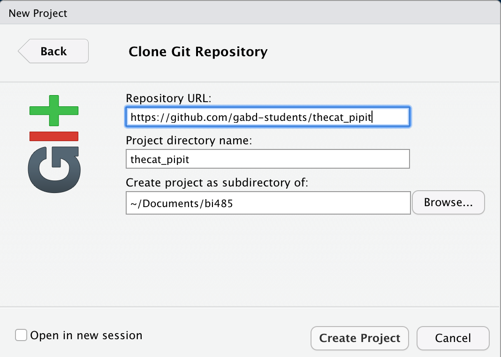

By the end of this assignment, you should

- have a GitHub account;
- installed Git, R, and R Studio; and
- edited your README.md file with Markdown.

**Click on any blue text to visit the external website.**

***

## Part 1 of 2

### Register for a free GitHub account

Register for a *free* [GitHub account](http://www.github.com), and then, fill out [this form](https://semo-gabd.shinyapps.io/485info/) with your name, GitHub user name, and other requested information. I am using this information *only* for course management. If all goes as I have hoped, you have already done this. 

- Follow the advice given in [Chapter 5](http://happygitwithr.com/github-acct.html) to register for your free GitHub account. *Do not pay for private repositories for this course.* 

- Optional: complete this [GitHub tutorial](https://guides.github.com/activities/hello-world/), using your GitHub account (e.g., https://github.com/\<your_github_username\>). You do not have to complete this tutorial now but I recommend that you complete it sometime to help you understand Git.

### Software Installation

[Happy Git with R](http://happygitwithr.com/), written by Dr. Jenny Bryan, gives instructions for installing the software we will use for this course. Follow the steps below. Most chapters are *very* brief.

- Read [Chapter 1](http://happygitwithr.com/big-picture.html) and [Chapter 4](http://happygitwithr.com/installation-pain.html) for some background information and mental preparation.

- Follow [Chapter 6](http://happygitwithr.com/install-r-rstudio.html) to install R and R Studio. The preview version mentioned in the chapter is a reasonably stable development version, which will have the latest versions. For the current stable release, you can download the [desktop version.] https://www.rstudio.com/products/rstudio/#Desktop Either is OK for this course.

- Launch RStudio. You should see a screen that looks similar to the image below, although the console window may use the entire left side.


- In the console window, type `x <- 2 * 4` and press Enter. (`<-` is the less than symbol, followed by a dash.) Nothing will happen. Now, type `x` and press Enter , and you should see `[1] 8`. That indicates success!  You have installed R and RStudio.

- Follow the [Chapter 7 instructions](http://happygitwithr.com/install-git.html) *carefully* to install Git for your computer platform.  You may have to follow instructions in [Appendix A](http://happygitwithr.com/shell.html) to intall a command shell or command line tools. Take your time. It is not difficult but you must follow the instructions carefully.

- **Mac users:** You *must* have the command line tools installed for R Studio to work with GitHub. If you do not get the prompt to install the command line tools described in Chapter 7 or Appendix A, you can install them following [these instructions](http://osxdaily.com/2014/02/12/install-command-line-tools-mac-os-x/). You must have an active internet connection.

  1. Open `terminal` from the `/Applications/Utilities` folder.
  2. Type the following command into the terminal and press the Enter key.
  
  ```
  xcode-select --install
  ```
  3. Click the `Install` button in the dialog box. Wait for the installation to finish.

- Complete [Chapter 8](http://happygitwithr.com/hello-git.html) to configure Git. You do not need to configure a default editor yet because you will do most of your work in R Studio. If you did download a text editor to use, you can tell Git to use your editor. You can find specific configurations from [Software Carpentry](http://swcarpentry.github.io/git-novice/02-setup/). If you use Atom, for example, configure git with

```{}
git config --global core.editor "atom --wait"
```

## Claim Your Course Repository

I have created a public GitHub repository for your use during the course. I am the owner but you are a collaborator, which means you can edit (push) files in this repository. You should also have received an invitation to join this repository. All students can see all of the student repositories, including yours, but only you can push files to your repository. 

First, go to https://github.com/gabd-students to verify that you can see a repository in your name. It will be in the format `lastname_firstname`. You will see repositories for other students, too. If you do not see a repository with your name, send me an email telling me you do not see the repository. 

If you do see your directory, then please do *all* of the following steps. 

1. Make a folder on your computer for your work for this course. You can put it anywhere but keep track where you put it. For example, you can make a folder called "bi485" and put it inside `~/Documents` or `C:\Documents` folder. **I recommend that you keep the folder name short and without spaces.**

1. Launch RStudio (if it is not still running from above). 

4. Choose `File > New Project...`  

5. Choose `Version Control`, then `Git`.


6. Fill in the dialog box with the relevant information.
  - Enter `https://github.com/gabd-students/lastname_firstname` for the repository URL, substituting your last name, an underscore, then your first name.
  
  - Enter `lastname_firstname` for the project directory name. It may appear automatically when you fill in the first blank.
  
  - Enter the directory you created at the start of this exercise as the main folder (e.g., `~/Documents/bi485` or `C:\Documents\bi485`). The dialog should look something like this.
  
  


7.  Click on the `Create Project` button. R Studio will clone the GitHub repository on your computer in the folder you specified. 

  - If prompted, enter the GitHub user name and password you used when you created your GitHub account. Your screen should look similar to that shown on the next page.
  
  - **Remember the location of this repository.** You will do all of your homework in this folder.
  
  - I will refer to this repository on your computer as the **local repository** or **local repo.** The equivalent repository stored on GitHub is called the **remote repo.**
  
8. R Studio should look similar to this. Notice the list of files in the lower right window. Click once on the `README.md` file. It will open in the upper left window of R Studio. You will edit this file in Part 2 of this assignment. 

  - If you have any problems, please send me an email describing in detail any problems you had.


*Pipit the Cat cannot spell, apparently.*


### Optional

- [Chapter 9](http://happygitwithr.com/git-client.html) is optional. You will use RStudio most often to interact with Git and GitHub for this course. Later, you may find that a standalone Git client is helpful, especially as your Git-Fu grows stronger. I use [Git Kraken](https://www.gitkraken.com/git-client) because, well...[kraken.](https://en.wikipedia.org/wiki/Kraken)

- Read other chapters in [Happy Git With R](http://happygitwithr.com/) at your leisure. We may use part or all of some chapters in future exercises.

***

## Part 2 of 2

### Introduction to Markdown

Markdown is a way of formatting plain text with bold, italics, links to web pages, and more.

- Complete this [markdown tutorial.](https://commonmark.org/help/tutorial/) You can also download this [markdown cheatsheet.](https://github.com/adam-p/markdown-here/wiki/Markdown-Cheatsheet)

### Edit the README file

README files generally describe what is in the repository. For this assignment, your README.md file should tell a little about you and also reflect who you are as a person.  You will also use various `markdown` commands to practice using them. 

Edit your README.md file to include the requirements below.

If none of the requirements seem familiar, then take (or re-take) the [markdown tutorial](https://commonmark.org/help/tutorial/) and reference the [markdown cheatsheet.](https://github.com/adam-p/markdown-here/wiki/Markdown-Cheatsheet) Also, the `Help` menu in R Studio has a `Markdown Quick Reference` help item. `Help > Cheatsheets` has a link to an R Markdown cheatsheet PDF.

1. Replace the line that says "This repo belongs to \<user_name\> with your first and last name. Use a Heading 1 size for your name.

2. On the next line use a Heading 2 size for your institution, e.g.,

3. Use a Heading 3 size for headings that identify each of the next sections.

4. Insert a link to a *short* YouTube video that is one of your favorites or that you find interesting. Write a couple of sentences to tell why it is a favorite or why you find it interesting. Use **bold,** *italics,* and (optional) ~~strike through~~ on a couple of words for emphasis.

4. Make an *unordered* list of your top three \<things\>, like top three movies, top three pizza ingredients, top three bands, etc. Get creative.

5. Make an *ordered* list with the top three or bottom three of a different \<thing\>. Continue to be creative.

6. Make a table of with three columns and four rows. The first row should have the column titles. The remaining rows should have data. Left align the first column, center align the center second column, and right align the third column. Populate the table with useful information for the data. I do not care what you include but you may continue to be creative. As an example, here is a table introducing my cats.

| Name | Breed (not pure) | Age (years) |
|:-----|:----------------:|------------:|
|Pipit | Ragamuffin or Ragdoll? | 2   |
|Lynx  | Lynx-point Tabby       | 2.5 |
|Jet   | Egyptian Mau           | 13  |

7. Include a block quote from your favorite author, a favorite song lyric, or a favorite line from a movie, or some other inspiring source.

8. Separate each section with a horizontal line, like the one at the end of this list.

***

You will use markdown in all subsequent exercises so get comfortable with it.

### Commit and push the README file to your GitHub account.

The following steps will `push` your README.md file to GitHub for the world to see. Get used to this process because you will use it. A lot.

1. First, just be sure your local repository is up-to-date with your remote repository, choose `Tools > Version Control > Pull Branches` from the menu. You should get a dialog box that says already up-to-date. Close the dialog.

10. Choose `Tools > Version Control > Commit` from the menu. In the future, you can also use the appropriate keyboard shortcut, such as \<ctrl-option-m\> on the Mac, which I think is \<ctrl-alt-m\> in Windows.

11. Click the checkboxes next to the (probably) three files, shown in the upper left. Type "Initial commit." in the blank box in the upper right. Your screen should look similar to Pipit's.


12. Click on the `Commit` button. You should see a line that begins `>>> git commit -F` and some other computer-y looking things. This indicates your changes have been stored in your local repo, but they are not yet on GitHub. Close that box.

13. In the very upper right, click on the `Push` button. You can also choose `Tools > Version Control > Push Branch`. You should see `>>> git push origin refs/heads/master`, followed shortly by other computer-y looking stuff. Notice the short sequence of apparently random numbers and letters, like the `9cd54625` highlighted below. That is the SHA or "hash," a unique ID created each time you commit a change. This ID is what allows you to back up to any version of any file you track in Git.


  - In the future, you will point me to a specific SHA so that I will grade the specific version of a file that you want me to grade. You can also get the commit history of any file by clicking on the `History` tab in the upper left of R Studio's Commit dialog.

12. Open your browser and go to your repository at `https://github.com/gabd-students/<lastname_firstname>/` substituting your name, of course. You should see a list of your files and the formatted README.md file. 

***

*et Voilà*