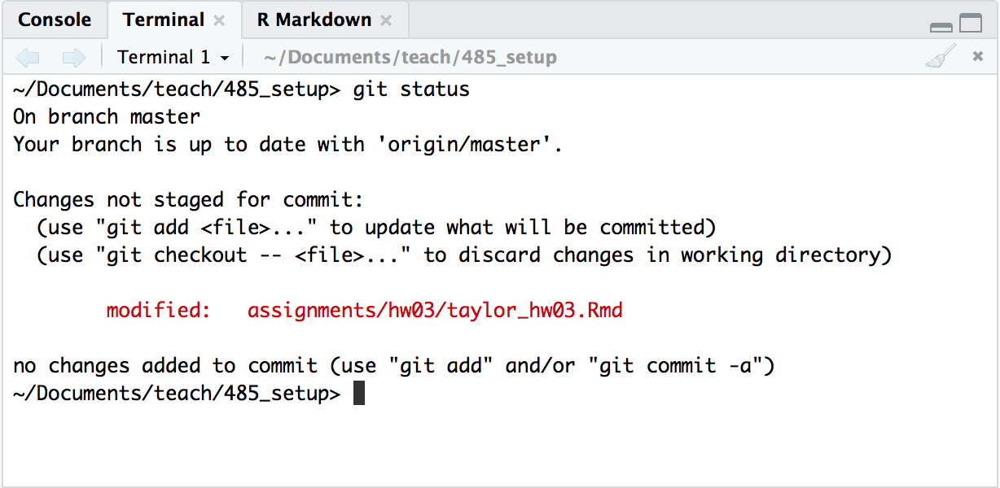
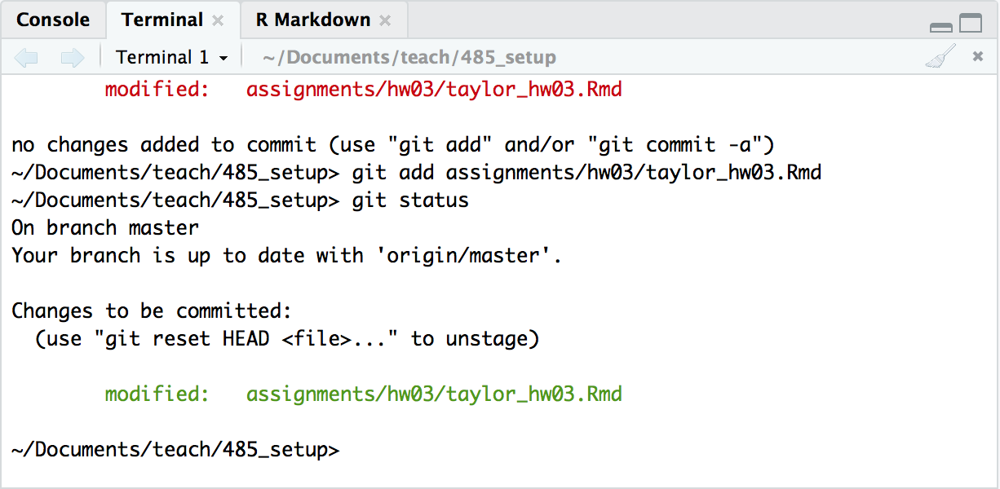
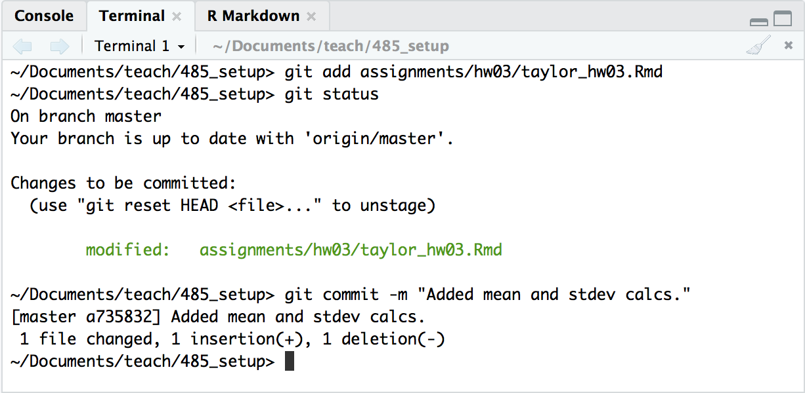
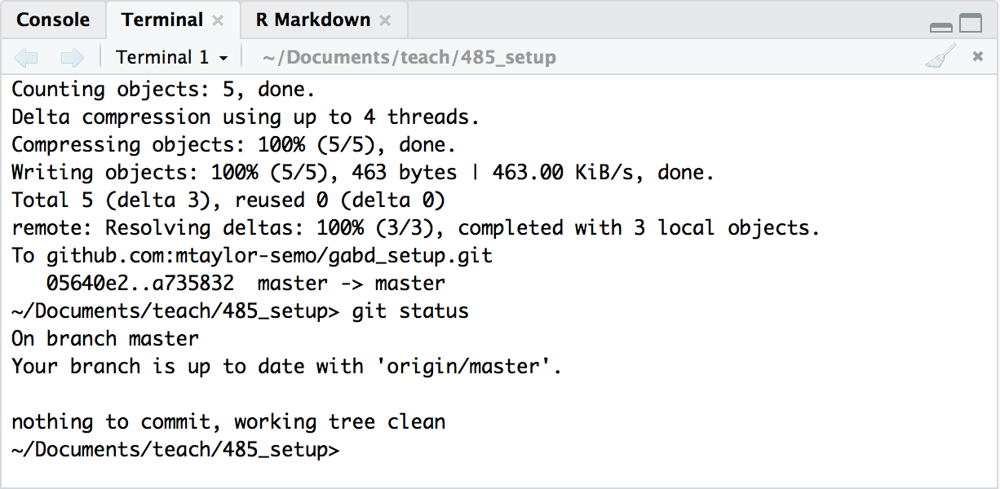
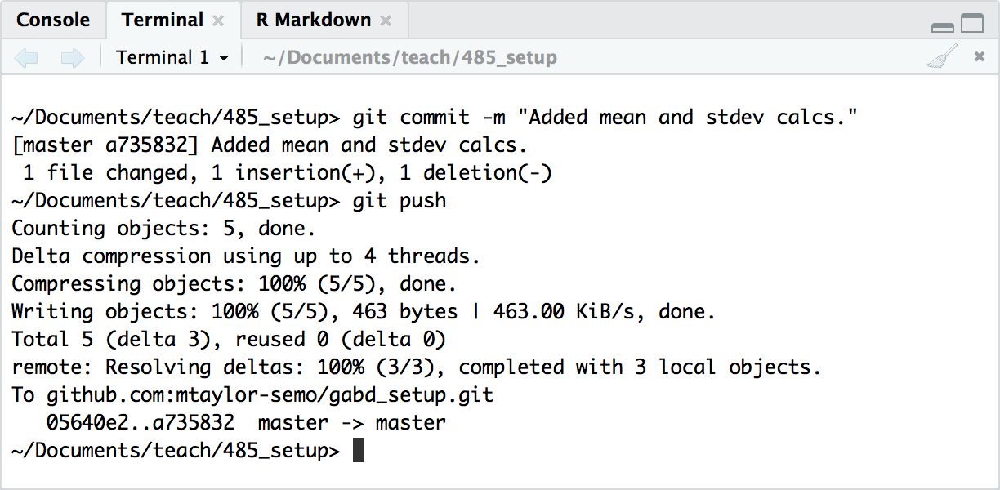

By the end of this assignment, you should be able to demonstrate an ability to

- use R notebooks and R markdown;
- insert, write, and evaluate code chucks; and
- confidently stage, commit, and push with Git.

Click on any blue text to visit the external website.

This assignment has two parts.

## Part 1: An R Notebook case study

Be sure to read the [notes](https://semo-gabd.github.io/notes/notes03.html) before starting this assignment.

The following simple example highlights the steps typical of the early stages of data analysis.

Use the new R Notebook document that you just created to complete both parts of this assignment. Delete all of the example information **except for the YAML header and the first code block.**

Save this file in your `hw03` folder as `<lastname_hw03.Rmd`. Notice the `.Rmd` extension. RStudio will automatically recognize the file as an R Markdown file. The `html_notebook` output line in the YAML header tells RStudio it is an R Notebook. 

If you no longer have the R Notebook file you created reading the [notes](https://semo-gabd.github.io/notes/notes03.html), then create a new R Notebook from the file menu. Edit the YAML header to look *exactly* like the following. Pay close attention to the double quotes, single quotes, and back ticks.

```{r eval=FALSE}
  ---
  title: "Useful Title"
  author: "Your Name"
  date: "`r format(Sys.time(), '%d %B %Y')`"
  output: html_notebook
  editor_options: 
    chunk_output_type: inline
  ---
```


As you work through both parts of this assignment, enter all of the code you see in this document into code chunks. *Run each chunk after entering your code to be sure it runs correctly.* After you have each chunk working correctly, then do a stage and commit, too. I'll remind you early on to stage and commit. After awhile, the steps should become habit. During this assignment, I will show you three ways to stage and commit. After that, you can decide which method you want to use.

**Note:** Saving a file and committing a file are different things. Save your file often. When you save your file, then Git is able to see your changes. You do not have to commit every time you save. You commit when you have a section of working code (e.g., after you complete an exercise). Commit a snapshop of your code, then move to the next chunk of code.

You will be required to submit your completed R Markdown document to your remote repo on GitHub by the due date.

**Type** the commands below into your R Notebook as you read through the case study. **Do not copy and paste!** Typing the commands is the best way to *drill your fingers* so that they remember the different commands and short cuts.


### Install the Tidyverse packages.

**You must do this step only once.**
  
  We will spend the remaining time of this course in the [Tidyverse](https://www.tidyverse.org), which is a series of **packages** that adds functionality to the base R program.^[Packages are one reason R is such a powerful analytical tool] You must install the packages from the internet so you need internet access. To install `tidyverse`, choose `Tools > Install Packages...` from the menu. Type `tidyverse` into the space provided. Be sure that `Repository (CRAN)` is selected and that the `Install dependencies` box is checked. Click the `Install` button. RStudio will automatically install everything you need from the Tidyverse. You only need to install packages once so if you installed `tidyverse` already, then you do not have to do this again.
  
We will use another package for this exercise too but, this time, use the command line in the RStudio console to install the package. The console is located in the lower left panel of RStudio. You can also choose `View > Move Focus to Console` from the menu or type `ctrl + 2`.

In the console, type `install.packages{"xtable"}`. Notice that RStudio will offer you a list of commands as your type. Type `xtable` between the quotes. *Case matters.* If you get the file name wrong, R will suggest possible (but not necessarily correct) matches. If successful, you will see a few lines informing you where the binary packages are stored. You do not need to remember this information.

**Note:** If you get an error saying that the `xtable` package is not available for your version of R, then run this command in the console to install the more up-to-date development version.

    install.packages("xtable", repos="http://R-Forge.R-project.org")

**Note:** Whenever you update R, you will have to reinstall the packages that you use, like `tidyverse`. While this can be a bit of a pain, it is essential for reproducibility. As software versions change, bugs are fixed, algorithms are improved, and other changes occur. Thus, someone using different combinations of R and associated packages might get a result different from you, the [antithesis](https://www.dictionary.com/browse/antithesis) of reproducibility. Fortunately, installing packages is easy and you do not have to upgrade R or RStudio often.

### Load the Tidyverse packages.

You must load the tidyverse packages (and any other packages) for each session that needs them. Load the packages in the first code chunk of your R Notebook. Choose `Code > Insert Chunk` to insert a blank code chunk. Or, you can type `cmd + option + i` (Mac) or `ctrl + alt + i` (PC) to enter a blank code chunk. Type `library(tidyverse)` in the blank space between the starting and ending tick marks. The `library()` function loads the tidyverse packages.

If you typed it correctly, it should look like this:

````
```{r}`r ''`
library(tidyverse)
```
````

Run this chunk by pressing the small green arrow at the upper right of the code chunk. You should see a list of eight tidyverse packages that were loaded. The packages could be loaded separately, such as `library(ggplot2)` and `library(dplyr)`. Loading `tidyverse` loads them all at once, which is OK because we will use most of these packages for the remaining assignments. *The version numbers displayed when your packages load might be different from those shown above.*

```{r echo=FALSE}
library(tidyverse)
```

You are also warned that the `filter()` and `lag()` functions in the `dplyr` package (one of the `tidyverse` packages) conflict with R's built-in functions of the same name. You do not need to worry about these conflicts.

Save your file. If this is the first time you are saving your file, then (1) shame on you for not following the instructions given above, and (2) go follow the instructions above.

#### Stage and Commit Method 1

This is a good time to do your first stage and commit. The steps below assume that you read the [notes](../../notes03.html) for this assignment. If you haven't, do so now or you will be confused.

- Choose `Tools > Version Control > Commit...` from the menu. You can also type `ctrl + option + m` (Mac) or `ctrl + alt + m` (PC).

- Your file should be listed, with two yellow "?" boxes to the left of the name, indicating the file is not yet being tracked.

- Click the `Staged` checkbox to the left of your file name, in the upper left of the window. This stages the file, telling Git you are ready to take a snapshot of your file in this state. This corresponds to the `git add` command. The yellow boxes should change to a single, green "A" box, indicating the file has been added to the staging area.

- Type a brief message into the `Commit message` box. As this is your first commit for the file, something like "Initial commit." is good. 

- Press the `Commit` button. Git just recorded a snapshot of your file in your local repository. Close the small window that popped up during this step. The larger window should still be open. This corresponds to the `git commit -m "message"` command.

- *Optional 1:* If you want, you can push this snapshot to your remote repo on GitHub. To do so, click the `Push` button with the green, upward-pointing arrow. After a moment, you should see a series of letters and numbers (the SHA number), indicating the file was successfully pushed.

- *Optional 2:* If you pushed the file to your remote repo, open your web browser and go to https://github.com/gabd-students/, find your repository (\<lastname_firstname\>) and look inside. You should see your `hw03/hw03.Rmd` file.

- Close the large window so that you you see your normal RStudio layout.

**Note:** If you do not see this, the email me and await my response before doing anything else. In your email, tell me what you do see. Screenshots are helpful.

***

For this part of the assignment, you will use a special data set called `anscombe`. The Anscombe data set has four sets of data. Each set has 11 pairs of carefully chosen values to illustrate the importance of visualizing your data. 

Enter a new empty code chunk and type `anscombe`, as shown below.  Run the code chunk. (Green arrow, right?) You should see a table like that below. If you do not see the table, did you remember to put the command in a code chunk? Also, *case matters.* `anscombe` will show you the table but `Anscombe` or `ANSCOMBE` will not. Make sure you spelled it right, too.

```{r}
anscombe
```

The data are arranged as four *x* columns (*x1* to *x4*), and four *y* columns (*y1* to *y4*). For graphing, *x1* pairs with *y1*, *x2* pairs with *y2*, and so on. For reasons that will become clear later, graphing is easier if there is only one column for *x* values and one column for *y* values. 

Also notice the HTML links at the bottom of the table. R defaults to showing the first ten rows of a table, with links to view the rest of the table.

### Wrangle the data

Data are often not in a format suitable for efficient analysis in the tidyverse, referred to as "untidy" data. Untidy data must be made "tidy, which means it must be rearranged or "wrangled" into a suitable format. Wrangle the anscombe data with the following commands from the `dplyr` package (part of the tidyverse). 

Do not worry right now about what the code means. You will learn more later. For now, just know that the results are stored in a variable called `ansc`.

<!--The code adds a `dataset` column to track the four sets (pairs) 
of values. #The rearranged data are stored in a new dataframe variable called `ansc.` -->

Carefully type in the following code chunk (you should know how to insert an empty code chunk by now). Remember that spelling and punctuation matter. When you press the Enter key after typing each line, RStudio should automatically indent the lines as shown below. The indentations make the code much easier to read.

*Hint:* Typing `option/alt + -` (dash) will enter the ` <- ` with suitable spacing. Typing `Cmd/ctrl-shift-m` will enter the ` %>% ` pipe combination in a single stroke. You will learn more about pipes later in this exercise. You will learn more about the other commands in upcoming exercises.

```{r}
ansc <-
  bind_cols(
    anscombe %>% 
      select(matches("x")) %>% 
      gather(dataset, "x"),
    anscombe %>% 
      select(matches("y")) %>% 
      gather(key, "y")
  ) %>%
  select(-key) %>% 
  mutate(dataset = gsub("x", "", dataset)) %>%  
  as_tibble()
```

View the wrangled data set. If you entered the code correctly, you should see the following table. If you have an error instead, review the code *carefully* to find the error and fix it. Also, if you click on the `Environment` tab (or press `ctrl-8`), you'll see `ansc` listed as an environmental variable.

```{r}
ansc
```

#### Stage and Commit Method 2

Time to do your second stage and commit.

- Choose the `Git` tab from the upper right panel in RStudio, or type `ctrl + 9`. 

- Your file should be listed, with a blue "M" box left of the name, indicating your file has been modified since the last commit.

- Click the `Staged` checkbox to the left of your file name. Remind yourself that this step stages the file, or tells Git you are ready to take a snapshot of the changes you made since the last commit. This corresponds to the `git add` command. The position of the blue box shifts left, indicating it has been successfully staged.

- Click the `Commit` button just above the list of files. This brings up the window you saw in Method 1. 

- Type a brief message into the `Commit message` box. The message should describe the changes you made since the last commit, such as "Wrangled the anscombe data."  

- Press the `Commit` button. Git just recorded another snapshot of your file. Close the small window that popped up during this step. The larger window should still be open. This corresponds to the `git commit -m "message"` command.

- *Optional 1:* If you want, you can push this snapshot to your remote repo on GitHub. To do so, click the `Push` button with the green, upward-pointing arrow. After a moment, you should see a series of letters and numbers (the SHA number), indicating the file was successfully pushed.

- *Optional 2:* If you pushed the file to your remote repo, open your web browser and go to http://gabd-students.github.io, find your repository (\<lastname_firstname\>) and look inside. You should see your `hw03/hw03.Rmd` file.

- Close the large window so that you you see your normal RStudio layout

***

### Perform some calculations

The `anscombe` data were carefully designed so that the *x* and *y* values of each dataset have the same mean and standard deviation. To see this, apply the built-in `mean` and `sd` R functions to each set of *x/y* pairs, using the `summarize` function from `dplyr`. 

**Note:** RStudio will suggest `summarise` (with an "s" instead of a "z"), which you can use. The developer of the tidyverse, Hadley Wickham, is from New Zealand, and recognizes that many words have slightly different spellings between British and American English. He included both spellings in his packages, so, `summarise` and `summarize` do the same thing. `colour` and `color` do the same thing, and so on.

```{r}
ansc %>%
  group_by(dataset) %>%
  summarize(
    mean_x = mean(x),
    stdev_x = sd(x), 
    mean_y = mean(y),
    stdev_y = sd(y)
  ) 
```

Notice that each set of *x* values has the same mean and standard deviation (to two decimal places), as does each set of *y* values. 

#### Stage and Commit Method 3

This time, you will stage and commit your file by typing the git commands directly in the terminal.

- Choose `View > Move Focus to Terminal` (or type the key combination shown in the menu).

- Type `git status` in the terminal and press Enter. You should see your file listed, probably in red, similar to this image of my terminal window.



Git lists the file under `Changes not staged for commit:`, and tells me I can type `git add \<file\>` to add it.

- Type `git add \<file\>`, where `\<file\>` is the name of your file. Type the entire path and file name. In my example, I typed `git add assignments/hw03/hw03.Rmd`. There are some shortcuts available but you want to be sure of what you are doing. You could type `git add .` (period), which adds *all* unstaged files. You could type `git add *.Rmd`, which adds all files that end with the `.Rmd` extension. 

- After you add the file for staging, type `git status` and press Enter. Git should now list your file under `Changes to be committed:` and shown in green. The file is staged but not yet committed.



- Type `git commit -m "Added mean and stdev calcs."` or similar brief, informative message. Press enter. Git once again takes the current snapshot. Notice at the bottom of this screenshot that Git shows my commit message and that 1 file was changed.



- Type `git status` and press enter again. Your file is no longer listed because Git filed away the snapshot. Git tells you:

```
On branch master  
Your branch is up to date with 'origin/master'.    

nothing to commit, working tree clean.
```



Do not worry right now about `origin/master.` We will talk about it in a future exercise.

*Not optional:* You may or may not have pushed your previous commits to GitHub but we will all do it this time.

- Type `git push` and press enter. In a few moments, you will see something similar to my results. All of your previous commits are now stored on GitHub,



- Open your web browser, go to http://gabd-students.github.io/, find your repo, and look inside. You will see your `hw03.Rmd` file.

**Note:** If you run into problems or your file is not listed, open an issue in the `internal_discussion` forum and explain the problem in as much detail as you can. Also tell whether you were able to complete the first two stage and commit methods.

***

### Visualize Your Data

If you had data with similar means and standard deviations, like the `anscombe` data, you might be tempted to think that your data do not differ among the four sets. You should confirm those result by creating a separate plot of each data set. Type the following into a blank code chunk and run it.

```{r}
ansc %>% ggplot(aes(x, y, color = dataset)) + 
  geom_point() +
  facet_wrap(~dataset, ncol = 2)
```

Although the four data sets were *statistically* identical, the plots show that the data sets are actually very different from one another. These data were carefully constructed to make a very important point that underlies this course: 

**Always visualize your data!**
  
***

## Part 2: Two more R Markdown tricks

### Tables with R Markdown

You can make basic tables with Markdown but you can include better looking tables in R Notebook using the packages like `knitr` and `xtable`. `knitr` is installed by default with RStudio but you need to install the `xtable` package. 

Earlier you installed the `xtable` package.  Insert a code chunk, add the following two lines, and run them. You can add them here but the best practice is to load packages as the very first step of your analyses. So, I recommend that you go back to the top of your document and at these two lines in the same code chunk that you used to load the `tidyverse` package.

```{r}
library(knitr)
library(xtable)
```

Next, insert a code chunk with the following code. The `iris` data is a "built-in" data set that comes with R. Run the code. (I will not tell you do run your code anymore. You know what to do.)

```{r}
head(iris)
```

You get a decent looking table but notice that the table header (the first row) includes the `type` of data in each column (<dbl> for number and <fctr> for factor), which is usually not included.

You can make a better table with `kable`, a function in the `knitr` package (**k**nitr t**able**). `knitr` was installed when you installed RStudio. Insert a code block with the following code. The `align` argument specifies the alignment (*l*eft, *c*enter, or *r*ight) of the data in each column. `col.names` allows you to replace the default dataframe column name with your own column name.

```{r}
kable(head(iris), 
      align= c("l", "c", "r", "c", "l"),
      col.names = c("Sepal Length", "Sepal Width", "Sepal Length", "Sepal Width", "Species"))
```

#### Now you try it.

Use `kable` to format a table using the built-in data set called `airquality`. `airquality` has six columns of data. Run `head(airquality)` to see them. Right align the first two columns, center align the center, and left align the right two columns ^[You would not normally mix alignments like this.]. Change the column names of the first four columns to add the units of measurement (and to remove the period from `Solar.R`. Here are the column names you should use. 

- Ozone (ppb) 
- Solar R (lang)
- Wind (mph)
- Temp (°F)
- Month
- Day


This is one way of making a table with R Markdown. More often, you need to produce a table with the results of a statistical analysis. Let's do an analysis on `chickwts`, another built-in dataset. Type `?chickwts` **in the console** to learn more. The `?` is a short-cut to get help for any R function or data set. Run `head(chickwts)` in the console to see the data contained in teh `chickwts` data set.  

The purpose of the chick weights study was to see if the weight of young, growing chicks is affected by the type of food they eat. In "statistical shorthand," the question is whether weight is a function of feed. 

Run a quick statistical test to see if there is a significant relationship between weight and feed, using the built-in statistical function, `lm`. Store the results in the `chicks_lm` variable, and then use the `summary()` function to see the results. Be sure to use a tilde (`~`) between `weight` and `feed`.

```{r}
chicks_lm <- lm(weight ~ feed, data = chickwts)

summary(chicks_lm)
```

The summary includes a *lot* of information. You only need the `Coefficients` data to make a table. 

- Insert a code chunk and run `kable()` on `chicks_lm`. What happens? Write a 1-2 sentence summary of the results.


`xtable()` is a function from the `xtable` package that "knows" how to extract information from many types of summaries, which can then be given to `kable`, as shown here.

```{r}
xtable(chicks_lm) %>% kable()
```


#### Now you try it.

- Use `lm` on the `trees` dataset to see if `Girth` is a function of `Height`. Assign the results to a suitably-named variable.

- Use `xtable()` and `kable()` to produce a table with the results.

### Equations

You can type set math equations easily, once you learn the format. R Markdown uses LaTeX ^[LaTeX is pronounced `lah-teck` or `lay-teck` and is really what you should be using instead of MS Word. But, baby steps$\dots$. ] to typeset [math symbols.](http://web.ift.uib.no/Teori/KURS/WRK/TeX/symALL.html), which means you can type set beautiful, complex equations. Type LaTex math commands between `$`$\dots$`$` (backslash and parentheses) for inline equations ($e = mc^2$) or between  `$$`$\dots$`$$` (backslashes and brackets) for a centered, standalone equation, 

$$\frac{\Delta N}{\Delta t} = rN\left(\frac{K-N}{K}\right).$$

Here are the commands I used to typeset Einstein's equation for special relativity and for logistic population growth.

```
$e = mc^2$

$$\frac{\Delta N}{\Delta t} = rN\left(\frac{K-N}{K}\right).$$
```

You can typeset chemical equations, like the bicarbonate buffering system so vital to oceans and your blood,

$$\mathrm{CO}_2 + \mathrm{H_2O} \longleftrightarrow \mathrm{H_2CO_3} \Longleftrightarrow \mathrm{H^+ + HCO_3^- \leftrightharpoons 2H^+ + CO_3^{2-}}. $$

(I used different types of arrows in the equilibrium equation for demonstration, a typographical no-no.)

I want you to use the LaTeX math commands ([link again](http://web.ift.uib.no/Teori/KURS/WRK/TeX/symALL.html)) to typeset a math equation from of one of these four options:

1. The Michaelis-Menten equation at top of this [Wikipedia page.](https://en.wikipedia.org/wiki/Michaelis–Menten_kinetics), which is used to model enzyme kinematics.

2. The Chi-square equation shown near the top of [this page.](https://www.statisticshowto.datasciencecentral.com/probability-and-statistics/chi-square/), a commonly used statistical test in Biology and other sciences. Note: You must use the Greek letter Chi ($\chi$), not the letter X.

3. The Bernoulli equation shown at the very top of [this page.](https://www.princeton.edu/~asmits/Bicycle_web/Bernoulli.html), which describes how fluid flow over mounds causes air to flow through Prairie Dog dens and water through burrowing marine worm tunnels.

4. Another equation of your choice and of similar complexity. $y = mx + b$ is not sufficient. Besides, I just took it.

Here are a few things you must know to typeset an equation.

- These are *not* part of the R language. Do not put them inside of code chunks.

- Use `\frac{numerator}{denomiator}` for fractions. For example, `\frac{3}{4}` yields $\frac{3}{4}$.

- Use `^` (caret) and `_` (underscore) for superscripts and subscripts. For example, `x_i = y^2` yields $x_i = y^2$. You can use both super- and subscripts on the same variable, such as `Y_i^2` to get $Y_i^2$.

- Use braces to super- or subscript more than one character. For example, use `N_{t + 1} = N_0e^{rt}` to get $N_{t + 1} = N_0e^{rt}$. Notice that only the zero is subscripted after the $N$.

- `\times` gives a very nice $\times$ symbol. If you prefer, you can use `\cdot` for multiplication, e.g., $x \cdot y$. `\div` gives a nice $\div$.

- `\sqrt{x}` yields $\sqrt{x}$. Need a cube root or some other $nth$ root? Try `\sqrt[3]{x}` for $\sqrt[3]{x}$.

There is a lot of power in R Markdown. Harness it! ^[Did you notice these footnotes? For a bonus pat on the back, include a footnote in your R Markdown document.]

***

By the way, did you know that $0.9999\overline{9} = 1?$ You can look it up but here is a simple proof:

$$\frac{1}{3} + \frac{1}{3} + \frac{1}{3} = \frac{3}{3} = 1,$$

and because,

$$ \frac{1}{3} = 0.3333\overline{3},$$

and because,

$$ 0.3333\overline{3} + 0.3333\overline{3} + 0.3333\overline{3} = 0.9999\overline{9},$$

it follows therefore that,

$$ 0.9999\overline{9} = 1.$$

***

*et Vóila*
