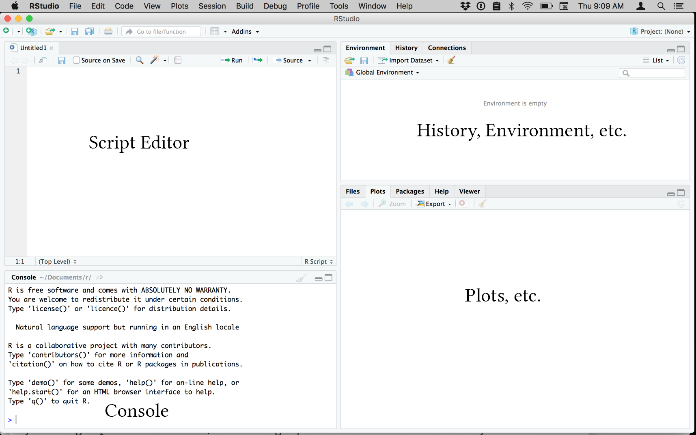
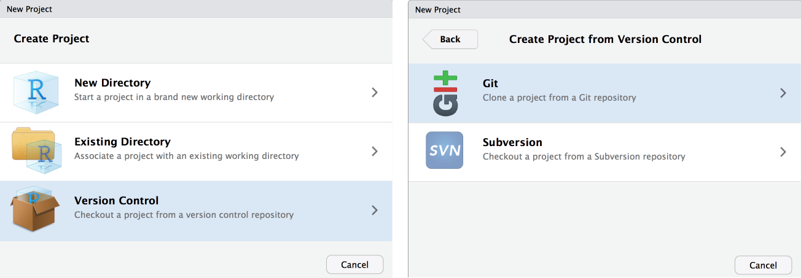
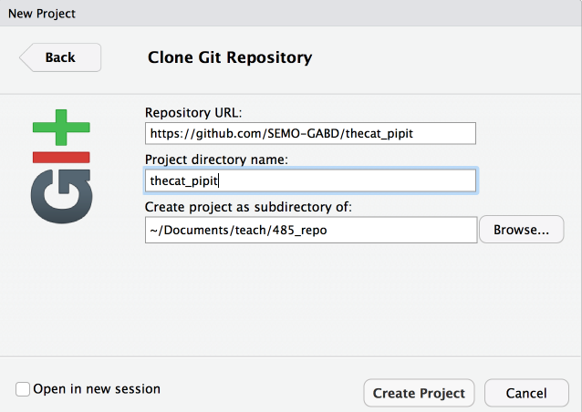
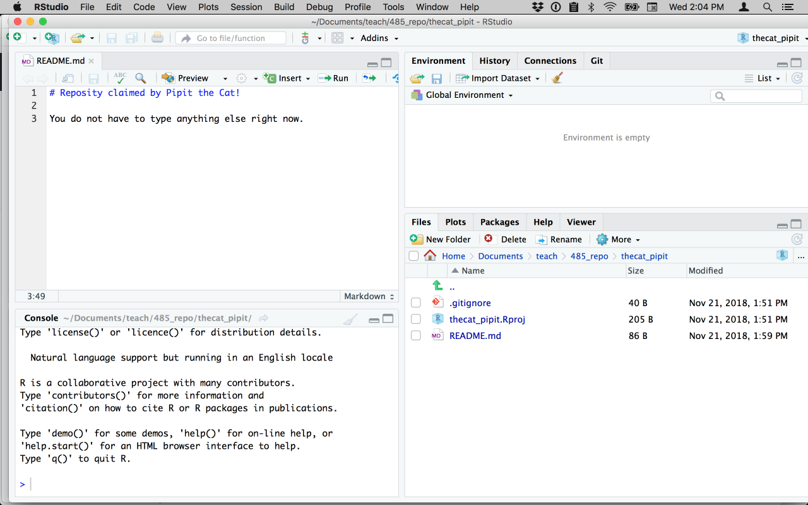
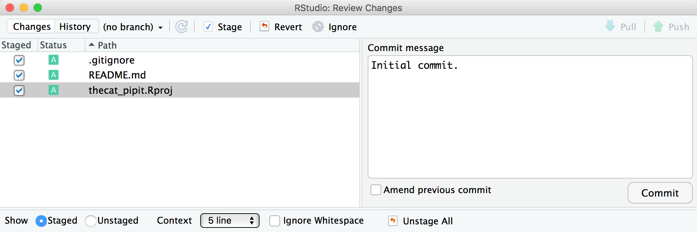

Please follow these instructions to claim your GitHub repository that you will use throughout this course.

First, go to [https://github.com/SEMO-GABD](https://github.com/SEMO-GABD) to verify that you can see a repository in your name. It will be in the format `lastname_firstname`. You will see other repositories, also. If you do not, send me an email telling me you do not see the repository, do the first three steps below, but skip the remaining steps (for now).

If you do see your directory, then please do *all* of the following steps. 

The following steps are outlined from [Chapter 6](http://happygitwithr.com/install-r-rstudio.html) of Happy Git With R, by Dr. Jenny Bryan. If you get stuck somewhere along the way, email me but also feel free to read through her book for ideas.

1. Make a folder on your computer for your work for this course. You can put it anywhere but keep track where you put it. For example, you can make a folder called "bi485" and put it inside `~/Documents` or `C:/Documents` folder. 

The screen shots below were captured from a Macintosh but they should be similar for Windows and Linux.

1. Install R for your computer platform:  [https://cloud.r-project.org](https://cloud.r-project.org)

2. Install the free version of RStudio: [https://www.rstudio.com/products/rstudio/download/](https://www.rstudio.com/products/rstudio/download/)

3. Launch RStudio. You should see a screen that looks similar to the image below, although the console window may use the entire left side. 

4. Choose `File > New Project...`  

5. Choose `Version Control`, then `Git`.

6. Fill in the dialog box with the relevant information.
  - Enter `https://github.com/SEMO-GABD/lastname_firstname` for the repository URL, using your last name, an underscore, then your first name.
  - Enter `lastname_firstname` for the project directory name. It may appear automatically when you fill in the first blank.
  - Enter the directory you created at the start of this exercise as the main folder (e.g., `~/Documents/bi485`). Click on the `Create Project` button.
  - If prompted, enter the GitHub user name and password you used when you created your GitHub account. If successful, your screen should look similar to that shown on the next page.

7. In RStudio, choose `File > New File > Text File`

8. Type `# This repository belongs to <me>.` Notice the hashtag. Include it as the first character on the line. Substitute your name for \<me\>. 

9. Save the file as `README.md`, following name *and case* exactly. GitHub will automatically display the README.md file when you or anyone else visits your repository. You will learn more about this in an early exercise. Your screen should look something like this:

*Pipit the Cat cannot spell, apparently.*

### The following steps will `push` your README.md file to GitHub for the world to see. Get used to this process because you will use it. A lot.

10. Choose `Tools > Version Control > Commit` from the menu. In the future, you can also use the appropriate keyboard shortcut, such as \<cntr-option-m\> on the Mac, which I think is \<ctrl-alt-m\> in Windows.

11. Click the checkboxes next to the (probably) three files, shown in the upper left. Type "Initial commit." in the blank box in the upper right. Your screen should look similar to Pipit's.

12. Click on the `Commit` button. You should see a line that begins `>>> git commit -F` and some other computer-y looking things. This indicates your changes have been stored locally, but they are not yet on GitHub. Close that box.

13. In the very upper right, click on the `Push` button. You should see `>>> git push origin refs/heads/master`, followed shortly by other computer-y looking stuff. You have just pushed your edits to GitHub. 

12. Open your browser and go to your repository at `https://github.com/SEMO-GABD/<lastname_firstname>/` substituting your name, of course. You should see a list of your files and the formatted README.md file. 

1. Please send me an email indicating that you were successful (hopefully) or describing in detail any problems you had.

# Thank you!

