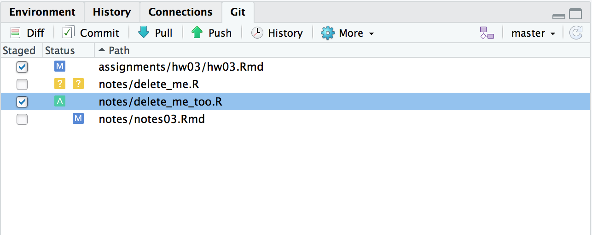

This web page is available as a [PDF file](./notes03.pdf)

## Read

[R4ds: Chapter 4](http://r4ds.had.co.nz/workflow-basics.html)

[R4ds: Chapter 26](http://r4ds.had.co.nz/communicate-intro.html)

[R4ds: Chapter 27](http://r4ds.had.co.nz/r-markdown.html)

[R4ds: Chapter 29](http://r4ds.had.co.nz/r-markdown-formats.html), sections 1-3. Skim the remaining sections to get a sense of what you can accomplish with R Markdown.

## Resources

#### R Markdown

[R Markdown: the definitive guide](https://bookdown.org/yihui/rmarkdown/) by [Yihui Xie](https://yihui.name/en/) et al. 

RStudio's [R Markdown page](https://rmarkdown.rstudio.com)

[R Markdown tutorial](https://rmarkdown.rstudio.com/lesson-1.html)

[R Markdown cheatsheet](https://www.rstudio.com/wp-content/uploads/2016/03/rmarkdown-cheatsheet-2.0.pdf)

#### R Notebooks

[Chapter 3.2](https://bookdown.org/yihui/rmarkdown/notebook.html) of Xie et al.'s *R Markdown* book linked above.

#### Git

Before you read through these, read the notes below and complete the assignment. Then refer back to these as reference.

Basic [Git commands:](http://happygitwithr.com/usage-git-cmds.html) You will not use all of these but you should be familiar with `git add`, `git commit`, `git push`, and `git status`. You will do most of these in RStudio by pushing buttons.

[Git branches:](http://happygitwithr.com/branches.html) This where you start to harness the power of Git. See also the official [Git Branching](https://git-scm.com/book/en/v2/Git-Branching-Basic-Branching-and-Merging) page.


## R Markdown and R Notebooks

The markdown commands that you learned in the [previous exercise](http://../hw/hw01.html) can also be used in R to make documents like web (HTML) pages and PDF documents. R Markdown is an enhanced version of markdown with additional features so you can include the results of your analyses in R. RStudio provides many features that make using R Markdown easy.

For this course, you will use R Notebook documents for the rest of your assignments, starting now. In RStudio, choose `File > New File > R Notebook` from the menu.  RStudio creates a new document with example R Markdown text. You will see familiar markdown commands, like `##` for section headers and `** … **` for **bold text.** 

You probably noticed the header at the top of the document. 

```
---
title: "R Notebook"
output: html_notebook
editor_options: 
  chunk_output_type: inline
---
```

The header is written in Yet Another Markup Language (YAML), which you use to set options for different types of documents. The `title:` option should reflect the contents of the document. `output:` tells R Studio to make an HTML notebook format from your R Markdown document. R Studio uses the date that you create your document but you should change the `date:` field to exactly that shown below, paying *careful attention* to the double quotes, single quotes, and back ticks. This will use R's `Sys.time()` function to get the current date, as shown in the example below. Your final document will then always show the date you made the final document. We might explore other YAML options in the future, as necessary.

```{r eval=FALSE}
  ---
  title: "Useful Title"
  author: "Your Name"
  date: "`r format(Sys.time(), '%d %B %Y')`"
  output: html_notebook
  editor_options: 
    chunk_output_type: inline
  ---
```

You may have also noticed the following block in your new document.

<!-- Enclosing a code chunk in 4 ticks to show
a complete code chunk is from:
https://yihui.name/en/2017/11/knitr-verbatim-code-chunk/ -->

````
```{r}`r ''` 
summary(cars)  
```
````

This is an R code chunk. A code chunk begins with three back ticks ` ```{r} ` on a line, followed by your R code, then three more back ticks ` ``` ` to end the chunk. When you make your document, the code will be evaluated in R, and the output will be included after the chunk (as specified by the `editor_options:` in the YAML header). In the case of `summary(cars)`, the `summary()` function calculates basic statistics for each variable in the data from the `cars` data set, which is then shown below the chunk.


```{r plot_cars}
 summary(cars)
```

You will use R code chunks extensively in your assignment documents.  You can type them manually but the easier way is to press `cmd + option + i` (Mac) or `ctrl + alt + i` (PC) while in your R Markdown document. RStudio will automatically insert a blank chunk, ready for you to enter your code.

Your R Notebook is an interactive document. You can run blocks of code separately or all at once. For example, click the right-most icon (green arrow; ) in the upper right of the code chunk to plot the cars data set. The plot will appear below the code chunk. You can also click the Preview button just above your R Notebook source document.

In many cases, you will want to run some code that depends on the results of code earlier in your document. In that case, click on the downward-pointed arrow in your code chunk, just left of the green arrow you just clicked. That runs all chunks above the current chunk. You can learn the function of these buttons if you hold your cursor over the button without clicking. 

To make the final document, click on the Knit button  above your document to make an HTML document from the R Notebook you just made. You will be prompted to save the file first. 

Time for your assignment. Keep this new R Notebook open, then go [complete HW 03.](../assignments/hw03/hw03.html)


## Git

The time has come to explain Git in more depth, so that you have a better understanding of what is happening when you click the checkboxes and push the buttons.

Git is a version control system (VCS) that tracks changes to files over time. As you work on a file, you can tell Git to take a "snapshot" of a file at any time. Git records information about the file so that the file can be reconstructed back to any past state. Git does *not* make copies of the files. It just records information about the changes. 

#### Repositories

A repository is a folder or directory that you have asked Git to track. Any files or folders inside a repository (repo, for short) can be tracked by Git. Git does not *automatically* keep track of files inside the repository folder, but it knows they are there, ready to be tracked if you want. Once you tell Git to track a file or folder inside a repo, Git will track it forever, or until you tell it to stop tracking the file. You can also  instruct Git to ignore certain files, folders, or types of files, such as files that end with `.tmp`. 

When you used RStudio to claim your \<lastname_firstname\> repository from GitHub on the first day of class, you created, or `initialized` a local repo in the folder you made for this course. For example, let's say you made a `~/Documents/bi485` or `C:\Documents\bi485` folder for this course, where your R Project file lives. That folder is actually a local Git repo! When you added your `hw02` folder and put your certification of completition inside, Git was ready to start tracking them. In RStudio, you clicked checkboxes and pressed buttons that told Git to start tracking that folder and file.

#### GitHub

GitHub is a cloud-based website that allows you to remotely store your local repositories. The \<lastname_firstname\> folder on the GitHub website is a remote repository that mirrors your local repository. The remote repositories that you are using for the class are private. Only you, me, and the other students can see them. Most repositories on GitHub are public, so everyone in the world has access to your files. This is a *good thing.* Trust me, you will find all sorts of help R scripts on GitHub. And someday, someone else might find yours helpful.

[This site](https://git-scm.com/book/en/v2/Getting-Started-About-Version-Control) has a nice, but mildly technical, summary of version control systems and Git.

## Using Git

As mentioned above, you have been giving commands to Git through the RStudio interface. Outside of RStudio, you typically type the commands in the terminal or shell. I will explain some commands now. You will see them again in the related assignment.

`git init`: This initializes or creates a local repo in an existing folder. You can do this in any folder at any time. You will not have to use this command for this course but you may use it often when you start using Git and GitHub on your own.

`git clone`: This makes a local repo from a remote repo, such as from GitHub. Formally, this is what you did in RStudio when you claimed your remote repo. The remote repo was cloned to a local repo on your computer. Again, you will probably not do this again for the class, but you may use it often in the future. 

`git add`: This tells Git to "stage" a file. This command really does one or two things. If it is a new file that Git is not yet tracking, then Git starts tracking it. If Git is already tracking it, or has just started tracking it, it "adds" a snapshot of the file at that point in time. Any changes you made since the last snapshot are noted. You will be able to go back to that snapshot in the future, if and when needed.

*You "added" a snapshot of a file when you clicked the checkbox next to that file in RStudio.*

`git commit -m "message"`: A "commit"" assigns a "tracking number" (remember SHA from [Assignment 1?](../hw01/hw01.html) to each snapshot, and permanently records the changes in your Git repo. You type a brief "message" after the `-m` to document the specific change.

*You commited the file to the Git repo when you typed a "Commit message" and pressed the commit button.*

`git push`: This sends changes (commits) to your remote repo (i.e., GitHub).

*You pushed commits to GitHub when you clicked the "Push" button.*

`git status`: This shows the status of uncommited files in a repo. It shows files that are not yet tracked, files that are tracked but not yet staged, and files that are staged, but not yet commited. You will probably use this command more than any other when working with Git in the terminal.

*You saw the status of your files in the Git tab or when you choose `Tools > Version Control > Commit...` window.*

The Git tab in RStudio (ctrl + 9) shows the status of your files. Compare this information below to this image. 



- Both `hw03.Rmd` and `notes03.Rmd` (this file, in fact) have been modified, indicated by the "M" in the small blue square left of the path.  - `hw03.Rmd` has been staged but not yet commited. 
- `notes03.Rmd` is being tracked but is not yet staged. Notice the difference in the position of the blue squares. 

    If I made a commit now, a snapshot of `hw03.Rmd` would be permanently recorded in the local Git repo but a snapshot of `notes03.Rmd` would not be made.
    
- `delete_me.R` is a new file that is not yet being tracked by Git, indicated by the two yellow squares with the "?" inside. 
- `delete_me_too.R` is a new file that was not tracked previously but is now being tracked and is staged, indicated by the green square with the "A" inside. All future changes to this file will also be tracked.

    If I made a commit now, a snapshot of `delete_me_too.R` would be permanently recorded in the Git repo but a snapshot of `delete_me.R` would not be made.

That was a lot of information to digest but RStudio makes it easy for you to do these steps often. Through the repetition of this course, you will soon be comfortable with these concepts.

## Good Git habits

**Stage and commit regularly.**  That is all there is to it, at least for now. RStudio makes it easy for you to develop the habit of regular commits. Think of it as good computing hygiene. And, if something goes wrong, you will be *very* thankful. 

In coming assignments, you should break the overall task into small steps. For example, you might write code to

  1. import your data,
  2. wrangle your data,
  3. write functions to more efficiently wrangle your data, and 
  4. graph your data. 

After you write code to import your data, you should stage and commit your code to Git. This gives you a snapshot of your work that you can go back to at that time. Wrangling data often involves multiple steps, as you will later learn. You should stage and commit after each step. Got something working right? Stage and commit. That gives you the freedom to try new ideas but to be able to go back to a working version if something goes wrong. Your graphs are built up in layers (as you will later see). Got a working layer? Say it with me now, "Stage and commit."

**Commit early. Commit often.**

[Assignment 03](../assignments/hw03/hw03.html) will help you learn R Notebooks and practice some basic Git.
