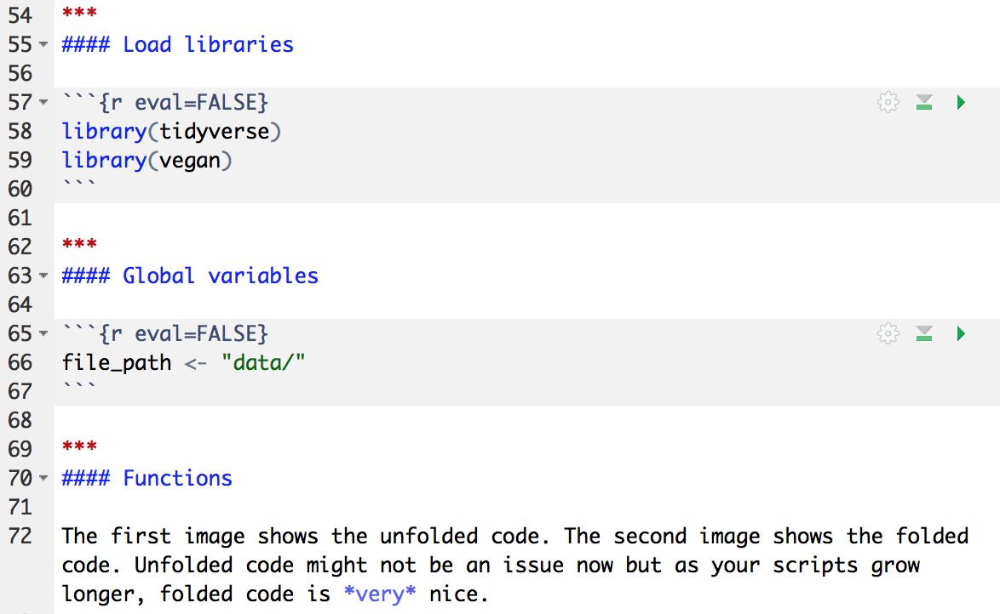
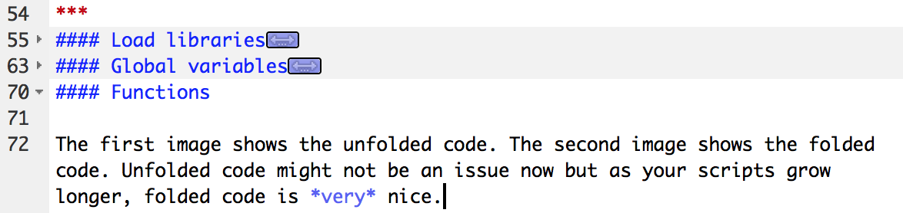

This web page is available as a [PDF file](./notes05.pdf)

## Reading and Resources

I've spread the reading assignments and related resources throughout these notes.

```{r echo=FALSE, warning=FALSE, message=FALSE}
library(tidyverse)
```

## Coding Style

Good code not only runs error-free but is easy to read, too. The [Tidyverse style guide](https://style.tidyverse.org) has good recommendations on writing functional and *readable* code.  I expect you to follow the conventions used in the style guide.

### Coding style: files

**Chapter 1** of the style guide covers like names and the structure of your file. Start organizing your code into sections. I tend to use the following sections for most of my R scripts.

- Load libraries
- Make global variables used through the script.
    - `file_path <- "data/"` is a good example.
- Custom functions. You will write functions later.
- Data import
- Data wrangling
- Main analysis (if needed)
- Graphing

If you are writing a script that is not using markdown (files that are nothing but R code, and have a `.R` extension), the `Code > Insert Section...` from the menu inserts the nice section dividers shown in section 1.2 of the style guide. I am writing this in a notebook so
that option is not available. 

The section divider shown in the style guide begins with a `#`, which creates a header line in markdown format. If you used that divider, it would create a big bold line, which you wouldn't want in your notebook. You can mimic a section divider by using `***` followed by a `####` header, like that shown here. `***` draws a rule across the page, followed by a small header.

```
***
#### Load libraries
```

A good reason to use section dividers is that you can use them for "code folding. You can show and hide sections separated by the dividers by clicking on small triangles between the line number and the `#` of the section divider^[You may have noticed these arrows in your previous notebooks]. Hiding code you are not working on makes it much easier to navigate around you file.  Here is an example.

***
#### Load libraries

```{r eval=FALSE}
library(tidyverse)
library(smatr)
```

***
#### Global variables

```{r eval=FALSE}
file_path <- "data/"
```

***
#### Functions

This image shows the unfolded code. Notice the small triangles next to the line numbers point downward, indicating unfolded code.

{width=50%}

This image shows the first two sections folded. The triangle points to the right, indicating folded code. You click on the triangle or click on the two-headed arrow icon adjacent to your divider title to expand and view the code. You can also choose options from the `Edit > Folding >` menu.

{width=50%}

Unfolded code might not be an issue now but as your scripts grow longer, folded code is *very* nice. I encourage you to give it a try. When you start writing code outside of notebooks, use the section dividers provided by RStudio. 

### Coding style: syntax

**Chapter 2** covers the format of your code. Focus especially on object names, spacing, and the use of indents. The proper use of spaces and indents is one of the easist ways of improving the readability of your code. Consider these two examples. The first is hard to read and hard to find mistakes. In fact, can you find the mistake?

```{r eval=FALSE}
data(iris)
ggplot(data=iris,aes(x=Petal.Length,y=Sepal.Length))+geom_point(aes(color=Species,shape=Species)+geom_smooth(aes(color=Species))
```

Here is the same code, nicely formatted, and with the mistake removed.

```{r}
ggplot(data = iris,
       aes(x = Petal.Length,
           y = Sepal.Length)) +
  geom_point(aes(color = Species,
                 shape = Species)) +
  geom_smooth(aes(color = Species))
```

The code and the *logic* of the code is much easier to read. Notice that I pressed the enter key after every comma, I have spaces around the equal signs, and that the `+` ends each line before I add another `geom`. Every time I pressed the Enter key, RStudio automatically indented the lines. 

You can also choose `Code > Reformat Code` or `Code > Reindent Lines` for help formatting you code. Note that neither of these options exactly match some of the recommendation made by the style guide. My example also did not correspond exactly to the guide. As long as you follow the guide reasonably close, you and I will be the happier for it.

**Note:** By spreading your code across more lines, the length of your file grows longer, increasing the value of code folding. *Fold your code!*


### Coding style: pipes

Pipe style closely mirrors syntax style, like spacing and breaking up long lines.


***

## Wranging II

Read [R4ds Chapter 5: Data transformation](https://r4ds.had.co.nz/transform.html). This chapter covers most of the other important functions for wrangling data. The three functions covered with the greatest depth are

- `mutate()`
- `summarize`
- `group_by`

These few functions harness a lot of power. Take your time working through the assignment, and really think about what you are doing. 

You can use `mutate()` to change variables depending on the values of the starting variables, using `ifelse()` and `case_when()`. If you have only two values, use `ifelse()`. `ifelse()` has this structure: `ifelse(eval, TRUE, FALSE)`. The first argument is the evalutation, The middle argument is returned if the evaluation is TRUE. The last argument is returned of the evaluation is FALSE.

Assume you have a `sex` column that with values `f` and `m`. You want to change the column so that it reads `female` or `male`. To change this with `ifelse()`, use

```{r eval=FALSE}
data %>% 
  mutate(new_column = ifelse(sex == "f", 
                             "female", 
                             "male"))
```

If sex equals `f`, then the `new_column` is assigned `female`. If not `f`, then the `new_column` is assigned `male`.

If you have more than two choices, `case_when()` is a better option, but the structure is more complex. Let's use the `darter.csv` example from the previous assignment. Substrate (`majsub`) was defined as s, fg, sg, lg, and c, which stands for sand, fine gravel, small gravel, large gravel, and cobble. If you want to change the initials to the words, then use `case_when()`,

```{r eval=FALSE}
darter_data %>% mutate(new_sub = case_when(
  majsub == "s" ~ "sand",
  majsub == "sg" ~ "small_gravel",
  TRUE ~ "other"))
```

This structure is different from typical R structures so some adjustment is required. `case_when` evaluates each option and assigns the value if it matches, and otherwise assigns the TRUE value. Walking through the example above, if `majsub` equals the value `s`, then  the `new_sub` column is assigned the value of `sand`. If not equal, then `case_when()` goes to the next argument. If `majsub` equals the value of `sg`, then the `new_sub` column is assigned the value of `small_gravel`. If `majsub` is not equal to `s` or `sg`, then the `new_sub` column is assigned the value of `other`. 

You will have to use only `ifelse()` for this assignment but be prepared for `case_when` situations in upcoming assignments.

***

## A graphing tip

As you learned before, you can pipe your data to `ggplot()` for graphing. I use this technique regularly.  Sometimes, you want to add a layer from another data set. You can do this, as shown below, because each geom can accept a separate `data = ` argument. 

```{r eval=TRUE}
avg_mpg <- mtcars %>% 
  group_by(cyl) %>% 
  summarize(mean_mpg = mean(mpg))


mtcars %>% ggplot() +
  geom_boxplot(aes(x = cyl,
                   y = mpg,
                   group = cyl)) +
  geom_point(data = avg_mpg,
             aes(x = cyl,
                 y = mean_mpg),
             color = "blue",
             size = 3)
```

***

As usual, you will work through the examples in the text, and then practice on real data.


