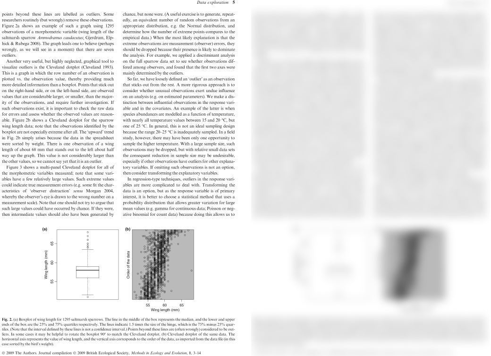

```{r setup, include=FALSE}
knitr::opts_chunk$set(echo = TRUE)
```


```{r echo=FALSE, message=FALSE}
library(tidyverse)
library(lubridate)
```

This web page is available as a [PDF file](./notes13.pdf)

## Strings

Carefully read [R4ds Chapter 14: Strings](https://r4ds.had.co.nz/strings.html) sections 1-4. I suggest you run the examples but I am not requiring that you do so. The assignment will require you to use some of the functions.

Strings are sequences of characters in `char` format. Any character, including numbers, can be treated as strings. Strings in R are enclosed in double or single quotes. Use double quotes to ensure best practice.

Focus, I mean really **focus** on Sections 3 and 4, regular expressions (regex). Regex is tricky to learn but once you learn it, you are able to harness a lot of power.  

For the DNA section, you will have to use the `read_lines()` function to import the file. `read_lines()` reads in the entire file, one line at a time. Each line is treated as a separate string. 

### The joy of regular expressions

**Fair warning:** I suspect this section will give you the most trouble. You will use several `stringr` functions in combination with regex patterns. Here are functions you will use at various places in the assignment.

- `str_c()`
- `str_replace()`
- `str_replace_all()`
- `str_to_upper()`
- `str_count()`
- `str_length()`
- `str_extract_all()`
- `str_which()`

Here some things to remember:

- Read the sections listed above and practice the examples and questions. They are not required but regex patterns take practice.

- R uses backslashes to escape certain characters such as `\t` for tab and `\n` for new line characters. To use these as part of regex pattern strings, you have to escape the backslash with a second backslash, like `"\\t"` or `"\\n"`.

- Use parentheses to capture groups that can be used later. For example, `"(CG)\\1\\1"` would find a repeating pattern of "CGCGCG". This technique is very useful when using `str_replace` when you want to keep part of the original string. Consider this example. You want to remove the letters and the dash, keeping only the numbers.

```{r echo=TRUE, include=TRUE}
tb <- data.frame(x = c("aa11-bb22", "xx88-yy99"))
tb

tb <- tb %>% 
  mutate(x = str_replace(x, "[a-z]+(\\d+)-[a-z]+(\\d+)", "\\1\\2"))
tb
```

- Use combinations of matching patterns to build up the pattern you want. For example, assume you have species names in the form of "Genus_species". You want to replace them as "G. species". Notice the use `\\.` in the replacement pattern to use an actual period.

```{r echo=TRUE, include=TRUE}
bacteria <- tibble(species = c("Escherischia_coli", "Bacillus_subtilis"))

bacteria <- bacteria %>% 
  mutate(species = str_replace(species, "([A-Z]{1}).+_(.+)$", "\\1\\. \\2"))

bacteria
```

- Use `|` in regex patterns as "or." For example, `"this|that"` will match "this" or "that."

```{r}
strings = c("String with this.", "String with that.", "String with the other.")

str_extract(strings, ".*(this|that).*")
```

- Use `str_count()` to count the number of times a pattern occurs. For example, how many times does a seqence of 2-4 As occur in this DNA sequence? Do not count overlapping sequences.  Notice the use of `{...}` to find strings of minimum and maximum lengths. The text for variations of the `{min,max}` pattern.

```{r}
dna <- "ATCACTAAATATGATTTGTGTAAAACCAAAATAAGATCTACAAACGAATAGAAGCTAGAGCGAAAAATGG"

str_count(dna, "[CGT]A{2,4}[CGT]")
```

- You can use `\s` or `[:blank:]` to represent whitespace. You can use `\d`, `[:digits:]`, or `[0-9]+` to represent a string of digits. They must be properly formatted as strings, as described in the text.

- Run `example(str_c)` or `?str_c` for an example of how to **c**ombine separate strings into a single string. I recommend trying the first one. `example(function_name)` runs the examples shown when you enter `?function_name`.

## Separating 

Read [R4ds Chapter 12.4.1: Separate](https://r4ds.had.co.nz/tidy-data.html#separate) for details of separating a single column into multiple columns

The `separate` function is another `tidyr` function to help you separate data in a single column into multiple columns. You have to provide the names of the columns to receive the data with the `into` argument and a regex pattern with the`sep` argument so the function knows where to separate the data.  This example separates the names of the Song Sparrow subspecies into three columns. The name is split into the columns, using space (`" "`) as the separation character.

```{r}
sparrows <- tibble(species = c("Melospiza melodia fisherella", 
                               "Melospiza melodia cleonensis", 
                               "Melospiza melodia heermanni", 
                               "Melospiza melodia mailliardi"))
            
sparrows

sparrows <- sparrows %>% 
  separate(species, 
           into = c("Genus", "species", "subspecies"), 
           sep = " ")

sparrows
```

Here is another example that has flower colors in a column. The data were not coded consistently, so colors may be separated by spaces, commas, or semicolons. Notice the use of `|` for "or". We'll also assume that the first color listed is most important to us, so we can drop extra text using the `extra` argument.

```{r}
flowers <- tibble(color = c("red", 
                            "red, pink, or white", 
                            "white and yellow", 
                            "silver; blue; gold"))
            
flowers

flowers <- flowers %>% 
  separate(color, 
           into = "main_color", 
           sep = ",| |;",
           extra = "drop")

flowers
```

The examples above are filled with hints to help you be successful with this assignment.

## Join together now

- Read [R4ds Chapter 13.4: Mutating joins](https://r4ds.had.co.nz/relational-data.html#mutating-joins) for details of how to merge two tibbles. You will use an inner join later.

Joins allow you to merge together separate data frames into one data frame. Many types of joins are possible, depending on what you want to accomplish. Look over Jenny Bryan's [Join cheatsheet.](http://stat545.com/bit001_dplyr-cheatsheet.html) She uses a fun example to show the results of different types of joins.

We will use only an `inner_join` so at a minimum, study her example of an `inner_join` in detail.

## Communicating with graphics

- Read [R4ds Chapter 28: Graphics for communication](https://r4ds.had.co.nz/graphics-for-communication.html) for reference.

Most of our assigments have involved data visualization but we have accepted the default output from `ggplot`, with only a few minor changes. The defaults are good while you are exploring your data. When you are ready to present your data to the broader community (scientific or public), more preparation is necessary.

`ggplot` has a lot of power to make nearly any type of graph you can think of. The depth provided by `ggplot` is greater than we have time to explore but there are a few things I want to touch on.  

For starters, you might have wondered why `ggplot` defaults to a gray background for its plots. This relates to what typographers call [typographic color](http://facweb.cs.depaul.edu/sgrais/typographic_color.htm) or "page color", which represents the average look of the text on the page. Most pages you read are black text on whitish paper. The average typographic color is going to be somewhat gray. 

This figure shows one of the pages from Zuur et al. that we used earlier. The page on the right was blurred to bring out the typographic color. Notice how the graph in the right panel tends to match the overall "grayness" of the page but the graph in the left panel leaves a big, white hole in the overall grayness.



Typographers believe that pages with more uniform color are easier to read and cause less straing. That is why `ggplot` defaults to a medium gray background. This is also one default that many people prefer to change for the final output, perhaps in part because we're used to graphs with white background. 

`ggplot` can be customized with little to lots of effort, depending on what you want to accomplish. `ggplot` also comes with several [built-in "themes"](https://ggplot2.tidyverse.org/reference/ggtheme.html) that you can add to a plot to quickly change the appearane of the plots. I will often use `theme_minimal()`, `theme_bw()`, or `theme_classic`. 

Additional themes are available via the [ggthemes](https://yutannihilation.github.io/allYourFigureAreBelongToUs/ggthemes/) package. I show an example with `theme_tufte()` in this assignment. We'll use `theme_map()` next week.  I encourage you to try different themes. Eventually, you will probably dig more deeply under the theme hood to tweak your plots even further.

The other thing I want to mention is color. Color is not always necessary. If you can [get it right in black and white](http://www.stonesc.com/wordpress/2010/03/get-it-right-in-black-and-white/), then your graph has the power to convey detailed information efficiently. However, color is often helpful and it is easier than ever to generate and publish color figures.  But, colors do convey information equally.

Here are some references for you to reference and think about visualizing your data in the future.

[Expert Color Choices for Presenting Data](http://www.stonesc.com/pubs/Expert%20Color%20Choices.pdf) by Maureen Stone.

[Practical Rules for Using Color in Charts](http://www.perceptualedge.com/articles/visual_business_intelligence/rules_for_using_color.pdf) by Stephen Few.

[Uses and Misuses of Color](https://www.perceptualedge.com/articles/dmreview/color.pdf) by Stephen Few.

[What about "color blindness?"](http://www.stonesc.com/wordpress/2010/05/what-about-color-blindness/) by Maureen Stone.

Some of the referenced articles discuss colorblindness. Colorblindness is not an accurate term because most non-blind people see color^[[Achromatopsia](https://ghr.nlm.nih.gov/condition/achromatopsia) is one form of true color blindness.] but not all people see color the same way. Choosing the right combination of colors is critical to present your data fairly and so everyone can interpret your results easily. A good rule of thumb is to not depend on just color to distinguish groups in a graph. Shapes and shades of gray, as you have seen, are also useful and often preferred.

When you prepare figures for others to see, you should run draft versions through a [colorblind similator.](https://www.color-blindness.com/coblis-color-blindness-simulator/) which allows you to see how your figure looks to those with other forms of color vision.


