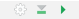
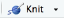

### Read

[Hadley: Chapter 4](http://r4ds.had.co.nz/workflow-basics.html)

[Hadley: Chapter 26](http://r4ds.had.co.nz/communicate-intro.html)

[Hadley: Chapter 27](http://r4ds.had.co.nz/r-markdown.html)

[Hadley: Chapter 29](http://r4ds.had.co.nz/r-markdown-formats.html), sections 1-3. Skim the remaining sections to get a sense of what you can accomplish with R Markdown.

### Resources

DataCamp [R Tutorial ](https://www.datacamp.com/courses/free-introduction-to-r) (requires free registration.)

### Notes

The markdown commands that you learned in the [previous exercise](week01a.md) can also be used in R to make documents like web (HTML) pages and PDF documents. R Markdown is an enhanced version of markdown with additional features so you can include the results of your analyses. R Studio provides many features that make using R Markdown easy.

For this course, you will use R Markdown documents for all of your assignments. In R Studio, choose `File > New File > R Markdown...` from the menu. Give the file an informative title, enter your name into the author field (if not already there), and leave "HTML" selected. R Studio creates a new document with example R Markdown text. You will see familiar markdown commands, like `##` for section headers and `** … **` for **bold text.** 

You probably noticed the YAML Header at the top of the document. 

```yaml
---
title: "Your Title"
author: "Your Name"
date: "a date"
output: html_document
---
```

YAML (Yet Another Markup Language) is used to set options for different types of documents. The `title:` option should reflect the contents of the document. `output:` tells R Studio to make HTML format from your R Markdown document. R Studio uses the date that you create your document but you should change the `date:` field to exactly that shown below, paying careful attention to the double quotes and back ticks. This will use R's `Sys.time()` function to get the current date, as shown in the example below. Your final document will then always show the date you made the final document. We might explore other YAML options in the future, as necessary.

```yaml
  ---
  title: "Useful Title"
  author: "Your Name"
  date: "`r format(Sys.time(), '%d %B %Y')`"
  output: html_document
#  editor_options: 
#    chunk_output_type: inline
  ---
```

You may have also noticed the following block in your new document.

    ```{r cars}
    summary(cars)
    ```
    
This is an R code chunk. A code chunk begins with three back ticks ` ```{r} ` on a line, followed by your R code, then three more back ticks ` ``` ` to end the chunk. When you make your document, the code will be evaluated, and the output will be included after the chunk (as specified by the `editor_options:` in the YAML header). In the case of `summary(cars)`, the `summary()` function calculates basic statistics for each variable in the data from the `cars` data set, which is then shown below the chunk.


```{r plot_cars}
 summary(cars)
```

You will use R code chunks extensively in your assignment documents.  You can type them manually but the easier way is to press `Cmd-opt-i` while in your R Markdown document. R Studio will automatically insert a blank chunk, ready for you to enter your code.

Your R Markdown document is an interactive document. You can run blocks of code separately or all at once. For example, click the right-most icon (green arrow; ) in the upper right of the code chunk to plot the cars data set. The plot will appear below the code chunk. You can also click the Preview button just above your R Notebook source document.

In many cases, you will want to run some code that depends on the results of code earlier in your document. In that case, click on the downward-pointed arrow in your code chunk, just left of the green arrow you just clicked. That runs all chunks above the current chunk. You can learn the function of these buttons if you hold your cursor over the button without clicking. 

To make the final document, click on  above your document. Click on Knit to make the HTML document from the default R Markdown document you just made. You will be prompted to save the file, first. 

## R Notebook: a case study

The following simple example highlights the steps typical of the early stages of data analysis.

Use the new R Markdown document that you just created to recreate the case study below. Delete all of the example information **except for the YAML header and the first code block.**

As you work through this case study, enter all code into code chunks, as shown. I suggest you knit your document after every block to be sure you are entering the code correctly. You will be required to submit your completed markdown document as part of the assignment for this block.

I strongly encourage you to type the commands below as you read through the case study. **Do not copy and paste!** Typing the commands is the best way to *drill your fingers* so that they remember the different commands and short cuts.


### Install the Tidyverse packages.

**You must do this step but only once.**

We will spend nearly all of our time during this course in the [Tidyverse](https://www.tidyverse.org), which is a series of packages that adds functionality to the base R program. You must install them first. Choose `Tools > Install Packages...` from the menu. Type `tidyverse` into the space provided. Be sure that `Repository (CRAN)` is selected and that the `Install dependencies` box is checked. Click the `Install` button. R Studio will automatically install everything you need for now from the Tidyverse. You only need to install packages once

### Load the Tidyverse packages.

You must load the tidyverse packages (and any other packages) for each session that needs them. In your document, Press `cmd-opt-i` to enter a blank code chunk. Then, type `library(tidyverse)` in the blank space between the starting and ending tick marks. The `library()` function loads the tidyverse packages.
```{r}
library(tidyverse)
```

You see which tidyverse packages were loaded. You are also warned that the `filter()` and `lag()` functions in the dplyr package conflict with R's built-in functions of the same name. You do not need to worry about these conflicts.

We will use the Anscombe data set, which has four sets of numbers. Each set has 11 pairs of carefully constructed values to illustrate the importance of visualizing your data. You view the entire data set by typing the name, as shown below.  When you run the code chunk, you should see a table like that below. If you do not see the table, did you remember to put the command in a code chunk? Also, *case matters.* `anscombe` will show you the table but `Anscombe` or `ANSCOMBE` will not.

```{r}
anscombe
```

The data are arranged as four *x* columns (*x1* to *x4*), and four *y* columns (*y1* to *y4*). For graphing,*x1* pairs with *y1*, *x2* pairs with *y2*, and so on. For reasons that will become clear later, graphing is easier if there is only one column for *x* values and one column for *y* values. 

Also notice the HMTL links at the bottom of the table. R defaults to showing the first ten rows of a table, with links to view the rest of the table.

### Wrangle the data

Data are often not in a format suitable for efficient analysis in the tidyverse, and so must be rearranged or "wrangled" into a suitable format. Wrangle the anscombe data with the following functions from the tidyverse packages. The code adds a `set` column to track the four sets (pairs) of values. The rearranged data are stored in a variable called `ansc.` 

Carefully type in the following code chunk, remembering that spelling and punctuation matter. You will learn more about each of the functions later.

*Hint:* Typing `Cmd/ctl-shift-m` will enter the `%>%` pipe combination in a single stroke.
```{r}
ansc <-
  bind_cols(
    anscombe %>% 
      select(matches("x")) %>% 
      gather(set, "x"),
    anscombe %>% 
      select(matches("y")) %>% 
      gather(key, "y")
  ) %>%
  select(-key) %>% 
  mutate(set = gsub("x", "", set)) %>%  
  as_tibble()
```

View the wrangled data set. If you entered the code correctly, you should see the following table. If you have an error instead, review the code *carefully* to find the error and fix it. 

```{r}
ansc
```

##

Next, apply some common R functions to calculate the mean and standard deviation for each set of *x/y* pairs.
```{r}
ansc %>%
  group_by(set) %>%
  summarize(
    mean_x = mean(x),
    stdev_x = sd(x), 
    mean_y = mean(y),
    stdev_y = sd(y)
    ) 
```
Notice that each set of *x* values has the same mean and standard deviation (to two decimal places), as does each set of *y* values. 

If these were your data, you might be tempted to think that that data do not differ among the four sets. Confirm that by creating a separate plot of each data set.
```{r}
ansc %>% ggplot(aes(x, y, color = set)) + 
  geom_point() +
  facet_wrap(~set, ncol = 2)
```

Although the four data sets were *statistically* identical, the graphs show that the data sets are actually very different from one another. These data were carefully constructed to make a very important point that underlies this course: **Always visualize your data!**
